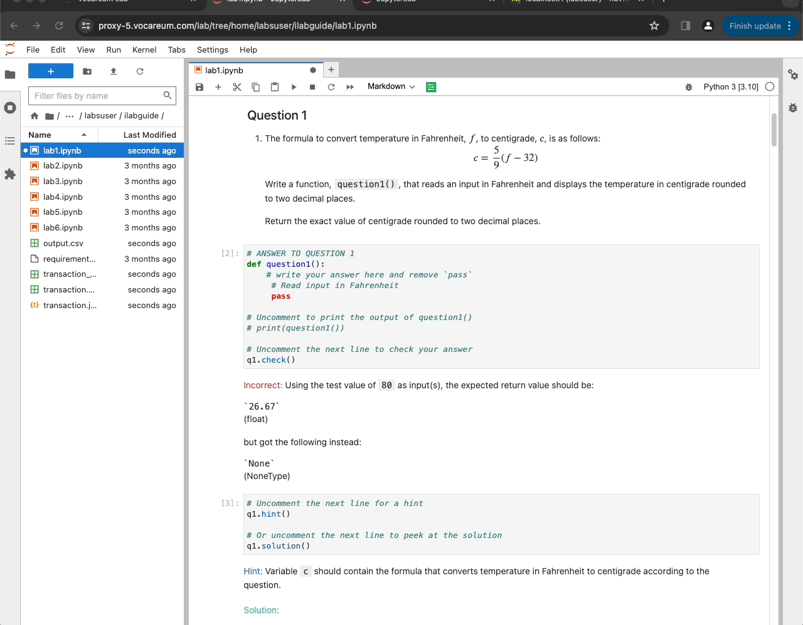

# FAQ - Virtual Lab Benefits
{: .no_toc }

Here are some key benefits of virtual lab that each course or programme will gain when they adopt virtual lab. 

  

    Table of contents
  

  {: .text-delta }
- TOC
{:toc}

---

## 0. Virtual Lab numbers

Virtual Lab is supporting over `15` modules at SUSS. 

As of 2 April 2024, Programming Lab guide is supporting over `1000` students across three programming modules - `ICT133`, `ICT162` and `ICT233`. Virtual Lab is run by EMR under Learning Services Cluster. 

## 1. Course Enhancement with Lab Guide and Autograding 

Include Python and LabGuide in your course to allow students to independently learn and progressively enhance their skills through self-service. 

Installation for each course is handled by the virtual lab team.

## 2. Unified Teaching and Learning Platform

Vocareum uses Ubuntu within a Docker environment, ensuring uniformity across teaching and learning platforms for both lecturers and students. 

For more details, visit the SUSS VLI FAQ page on Vocareum [https://suss-vli.github.io/faq/vocareum/#downloading-from-jupyterlab-ide](https://suss-vli.github.io/faq/vocareum/#downloading-from-jupyterlab-ide)

## 3. Remote Access for Lecturers 

Lecturers can remotely access students' Vocareum workspaces for support, accessible through the dashboard.

## 4. Pre-course app installation

The Virtual Lab team prepares by installing and setting up necessary applications and dependencies, supporting a wide range of tools including

- Jupyter Lab
- Vscode
- MySQL database
- MongoDB database
- R 
- AWS learning lab 
- Azure lab services
- Python packages like `seaborn`, `pandas`, `skilearn`, `matplot`, `beautifulsoup`, `numpy` and more libraries.
- Custom codeserver (vscode-like) extension via Open vsx registry
- GUI applications 
- Autograding via Jupyter Notebooks

## 5. Virtual Lab Support

For programming and platform support, contact the in-house devops team at [vlisupport@suss.edu.sg](mailto:vlisupport@suss.edu.sg).

## 6. Continuous Technology Updates 

Virtual Lab regularly updates to the latest technologies, maintaining a consistent standard across courses.

## 7. Personalized Learning and Analytics (Upcoming)

Gain Insights into lab guides and student data will be available through Kibana/ELK stack, providing valuable feedback to lecturers.

## 8. GUI Support in Container Labs

Enable GUI-based courses through the Ubunu/Linux interface. This is an option on top of the usual vscode interface that the lecturers can select. 

## 9. File Management

Files can be uploaded via Vocareum’s file tree or VSCode file upload feature.

For more details, please see [https://suss-vli.github.io/faq/vocareum/#how-do-i-upload-my-work-to-vocareum](https://suss-vli.github.io/faq/vocareum/#how-do-i-upload-my-work-to-vocareum)

## 10. AI integration (Upcoming!)

## 11. Automatic LTI integration with Canvas

Virtual Lab works in Canvas and the class list will automatically loaded via LTI. 